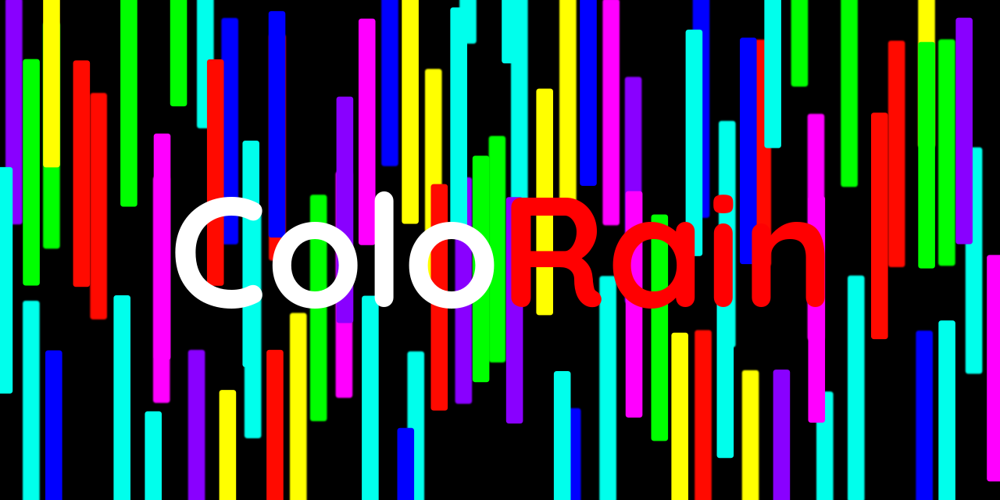

# Color Rain

> **ColorRain** is an **Arcade** game for all ages.
 
>
 
> > **Dare** your friends and parents to **beat** your score by holding out longer white being colored by the rain!

## Table of contents
- [Quick start](#quick-start)
- [Status](#status)
- [Downloads](#downloads)
- [Creator](#creator)
- [Licenses](#licenses)

## Quick start
### For Linux Users
> For linux users **Debian** based download the [linux](#linux-debian-based) version

### For Windows Users
> For Windows users download the [windows](#windows) version
 
## Status
> Note: **All captures have been made on linux Mint 20.03 "Una"**

###### Main Menu
> 

###### Game Play
> 

###### Game Over
> 

## Downloads

### Windows

> [Color Rain.zip](https://drive.google.com/file/d/13MNOJnilEIaN30CvMF4cDZjHtSmDZX_H/view?usp=sharing)

### Linux Debian based

> [Color Rain.x84_64.zip](https://drive.google.com/file/d/167AszwxqQcnI4g4EoMPy9MsOAuezEbCs/view?usp=sharing)

## Creator
 
 
 this game was developed by **_Ivandro Neto_**
 
## Licenses
 

